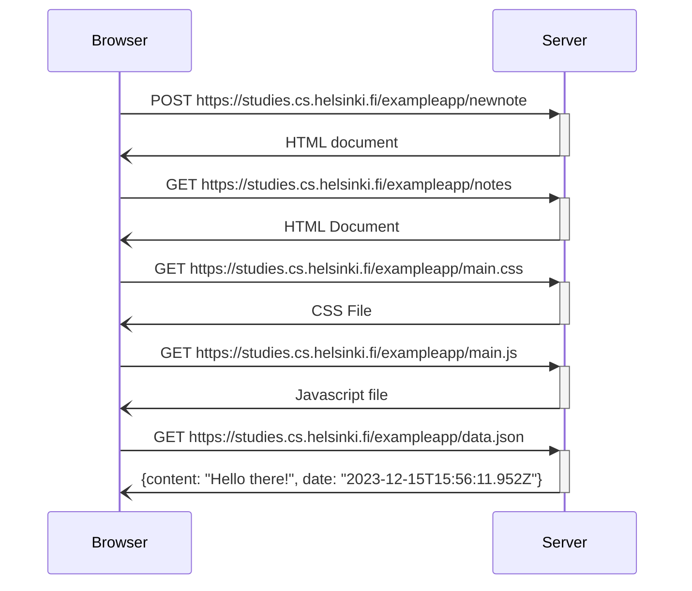
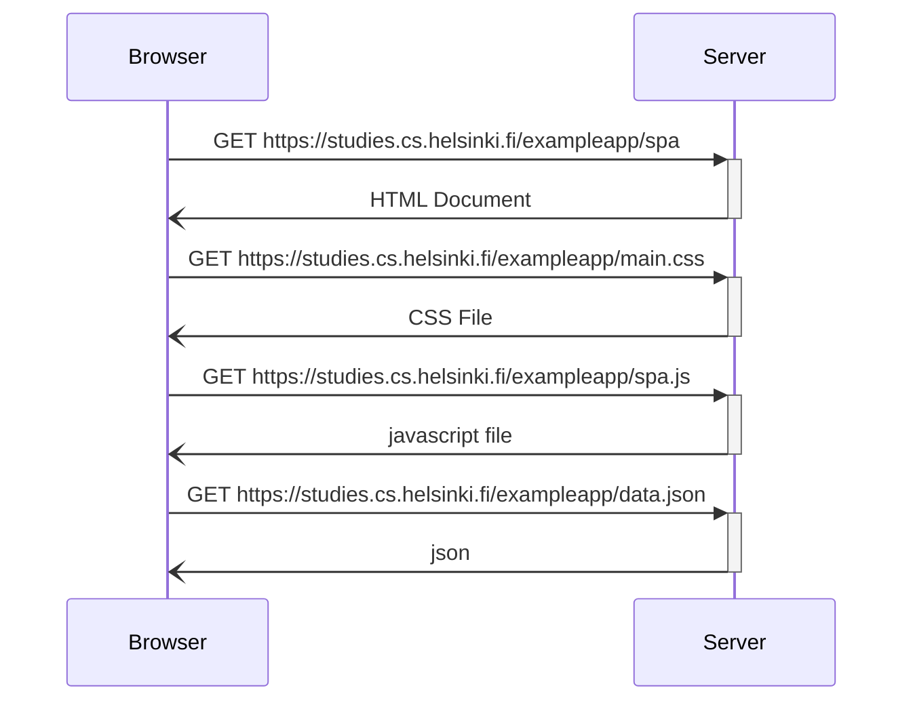
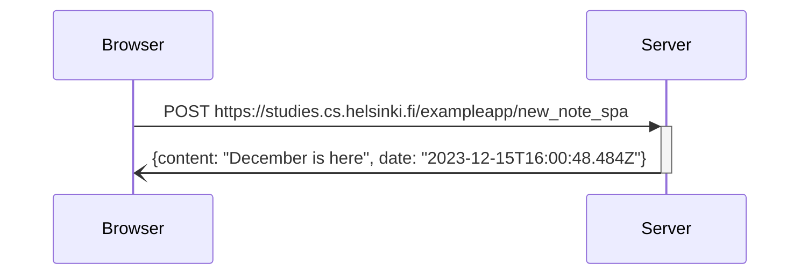

# part0
University of Helsinki | Full Stack

Student Name: Kritika Bhatnagar

0.4 New Note Diagram

```mermaid
    sequenceDiagram
    participant Browser
    participant Server

    Browser->>+Server: POST https://studies.cs.helsinki.fi/exampleapp/newnote;
    Server-)-Browser: HTML document;
    
    Browser->>+Server: GET https://studies.cs.helsinki.fi/exampleapp/notes;
    Server-)-Browser:HTML Document;

    Browser->>+Server: GET https://studies.cs.helsinki.fi/exampleapp/main.css;
    Server-)-Browser: CSS File;

    Browser->>+Server: GET https://studies.cs.helsinki.fi/exampleapp/main.js;
    Server-)-Browser: Javascript file;

    Browser->>+Server: GET https://studies.cs.helsinki.fi/exampleapp/data.json;
    Server-)-Browser: {content: "Hello there!", date: "2023-12-15T15:56:11.952Z"};
    

```
0.5 Single page app diagram

```mermaid
    sequenceDiagram
    participant Browser
    participant Server

    Browser->>+Server: GET https://studies.cs.helsinki.fi/exampleapp/spa;
    Server-)-Browser: HTML Document;

    Browser->>+Server: GET https://studies.cs.helsinki.fi/exampleapp/main.css;
    Server-)-Browser: CSS File;

    Browser->>+Server: GET https://studies.cs.helsinki.fi/exampleapp/spa.js;
    Server-)-Browser: javascript file;

    Browser->>+Server: GET https://studies.cs.helsinki.fi/exampleapp/data.json;
    Server-)-Browser: json;
```

0.6 New note in single page app

```mermaid
    sequenceDiagram
    participant Browser
    participant Server

    Browser->>+Server: POST https://studies.cs.helsinki.fi/exampleapp/new_note_spa;
    Server-)-Browser: {content: "December is here", date: "2023-12-15T16:00:48.484Z"};
```
